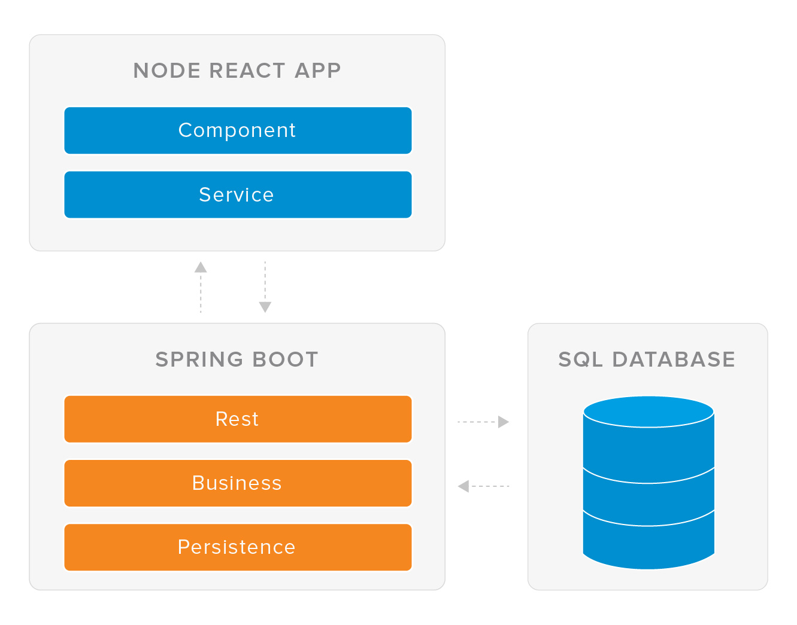

Personal Recipe Library
-----------------------

Task 
-----------
A simple web application that utilises all/most modules covered in the 8 week Nationwide/QA bootcamp training.

Web Application (Idea)
-----------
I created a simple personal recipe library that utilies the create, read, update and delete (CRUD) functionalities.

I wanted to create an environment where the user is able to simply make use of the CRUD functionalities without anything distracting and therefore trying to be accessible to all ages and/or disabilities.

Web Application (Creation)
-----------

This system is built with the following technologies:

-   [Spring boot](https://spring.io/projects/spring-boot) [server side services]

-   [React.js](https://reactjs.org/) [client side components]

-   [H2](https://www.h2database.com) [relational data]

Prerequisite
-----
Prior to running this application we need to setup our windows environments. Please complete the following installation steps in order: Java, Maven, GIT, Node.js and create-react-app (npm install -g create-react-app)

Note: If you have problems please contact your team mates via Slack.

Project Management
---------------
This project uses an agile methodology. Please see example board at the following link: [https://trello.com/b/msUSX9Vs/todo-board](https://trello.com/b/msUSX9Vs/todo-board)

Architecture
---------------
The following diagram shows the high level reference architecture for the application: 
